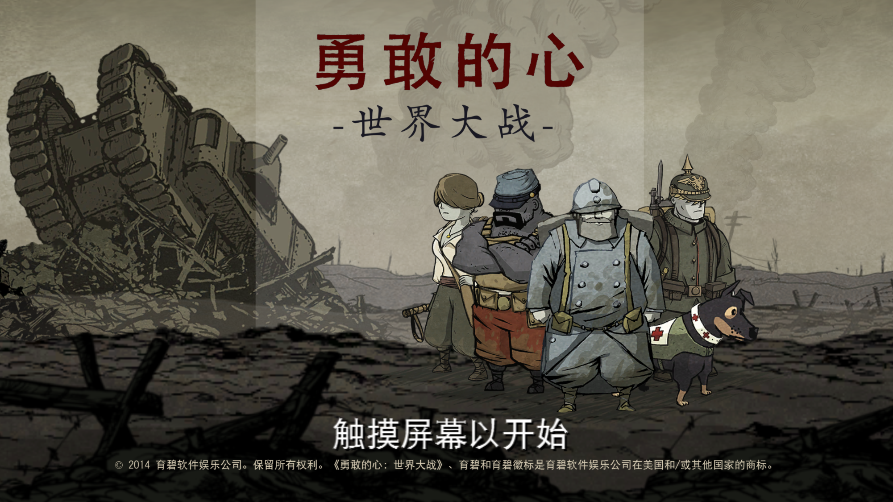
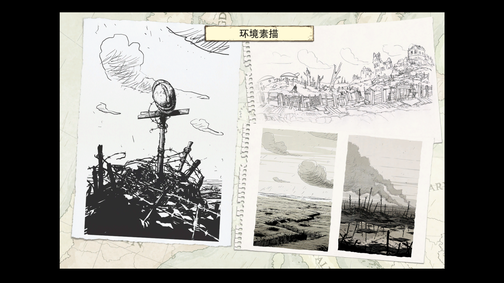
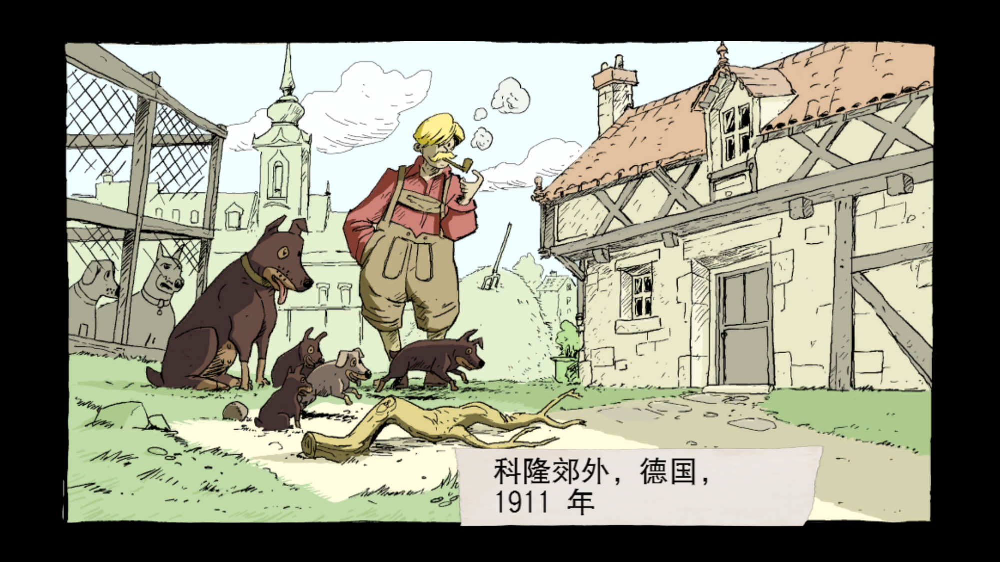
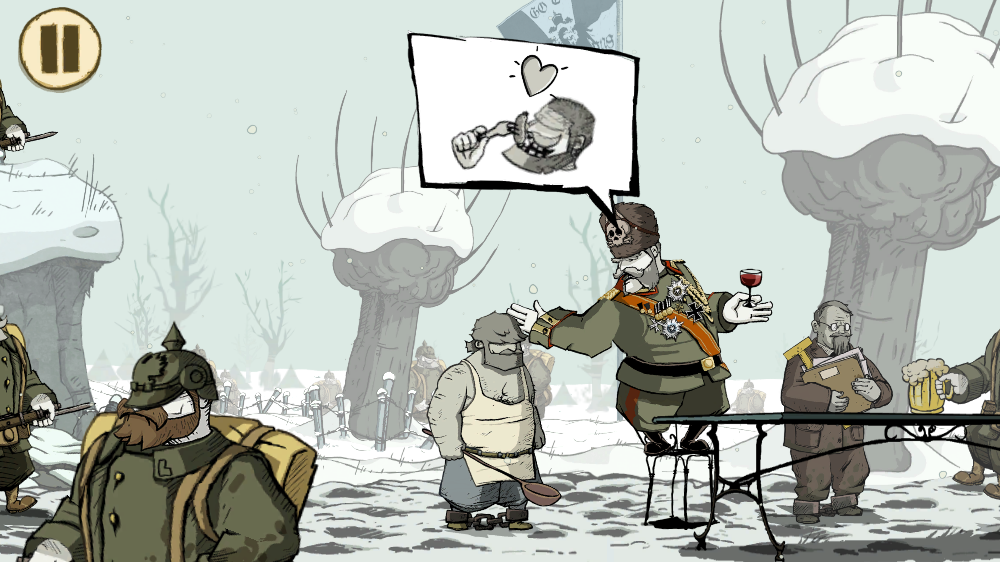

勇敢的心这个游戏应该是去年下半年上架的，当时好像是60元的价格，虽然一看到这个游戏就被画风吸引了，但是囊中羞涩还是没有买，最近突然发现它改成了免费+60元扩展包，确实是一款值得购买的游戏。

游戏灵感来源于一战时期的一封家信，四个素未谋面的人在战场上相遇，他们将帮助其中年轻的德国士兵寻找他的爱人，一路上四个人都在面临着不同选择，生存还是牺牲?友情还是爱情?

#####画风和音乐

记得以前买过宫崎骏的原稿绘本，而整个游戏给人的感觉就是在欣赏一本特别精美的漫画，虽然是关于战争的游戏，但是画风却给人很幽默诙谐的感觉，背景音乐配合着剧情，在游戏过程中会因为人物漫画式的动作而感到轻松，但是背景音乐让那种战争给人带来的痛苦和悲伤一直埋在心底，在剧情进展的时候一点一点扩散出来。

游戏中还包括了一个原画绘本和一个关于战地犬故事的漫画书。

#####玩法和难度

游戏的玩法比较简单，游戏中总共有四个角色，主角还佩戴了一条狗，人物的主要操作包括：左右移动（点击要移动的方向）；攻击（向攻击方向划动屏幕）。在遇到可以操作的物体时，物体上会有按钮提示操作，每个角色可以携带一个捡取的物品，在获得战地犬之后战地犬也可以叼一个物品。这里人物和狗的互动也很有意思。

作为一个冒险解谜类的游戏，勇敢的心几乎是没有游戏难度的，每一关玩过去几乎都是水到渠成的，这样反而能让人更加流畅的体会到整个游戏的剧情。但是游戏的内容仍然很丰富，你要穿过不停扫射的重机枪，在布满炸弹的地下挖隧道前进，安放炸药炸毁大桥，尽管是漫画的风格，但音乐的转变和画面的切换仍然能够让人感到战场的那种紧张感。

######剧情：5分

######画面：5分

######音乐：4.5分

######玩法：4分

确实是值得付出￥60购买的游戏。
